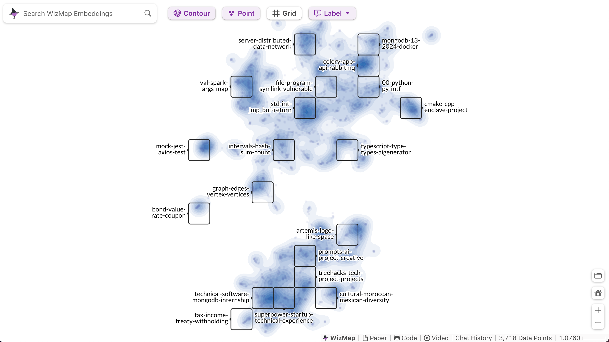

# Coeus - Repeatable Workflows via Natural Language

Our project enables __*Repeatable Workflows via Natural Language*__, automating multi-step processes with ease. It connects to a number of data sources and uses agents to take actions during execution. Workflows are saved as checkpointed graphs for reliability. RAG-powered memory preserves context for adaptive automation.

## Table of Contents

TODO: toc

## Features Overview

### Chat Interface with Chain of Thought & Agentic Behaviours

TODO: image

### Workflows as Checkpointed Graphs

TODO: image

### Embedding Visualization



## Running the Project

### Requirements

- Docker & Docker Compose [(installable via Docker Desktop)](https://www.docker.com/products/docker-desktop/)
- `Python >= 3.12`

## Sponsor Integrations

TODO: sponsor integrations

### Setup & Startup

All of the following commands should be run from the root `coeus/` directory.

```sh
# Create a virtual environment and install Python dependencies
./scripts/create_python_env.sh

# Spin up a local ElasticSearch database
docker compose up

# Start the API
./scripts/start_api.sh

# Start the App
TODO:
```
